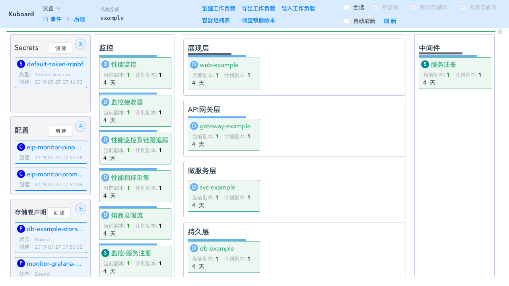

# kuboard-example

kuboard 的主要特点：
* 面向运维场景的设计
* 微服务分层显示
* 关联到微服务上下文的监控

详细文档请参考 Kuboard 官网，
[https://kuboard.cn](https://kuboard.cn)

kuboard-example 完成部署后的效果如下所示：

  <a href="http://demo.eip.work/#/login?isReadOnly=true&token=eyJhbGciOiJSUzI1NiIsImtpZCI6IiJ9.eyJpc3MiOiJrdWJlcm5ldGVzL3NlcnZpY2VhY2NvdW50Iiwia3ViZXJuZXRlcy5pby9zZXJ2aWNlYWNjb3VudC9uYW1lc3BhY2UiOiJrdWJlLXN5c3RlbSIsImt1YmVybmV0ZXMuaW8vc2VydmljZWFjY291bnQvc2VjcmV0Lm5hbWUiOiJrdWJvYXJkLXZpZXdlci10b2tlbi1mdGw0diIsImt1YmVybmV0ZXMuaW8vc2VydmljZWFjY291bnQvc2VydmljZS1hY2NvdW50Lm5hbWUiOiJrdWJvYXJkLXZpZXdlciIsImt1YmVybmV0ZXMuaW8vc2VydmljZWFjY291bnQvc2VydmljZS1hY2NvdW50LnVpZCI6ImE1YWFiMmQxLTQxMjYtNDU5Yi1hZmNhLTkyYzMwZDk0NTQzNSIsInN1YiI6InN5c3RlbTpzZXJ2aWNlYWNjb3VudDprdWJlLXN5c3RlbTprdWJvYXJkLXZpZXdlciJ9.eYqN3FLIT6xs0-lm8AidZtaiuHeX70QTn9FhJglhEyh5dlyMU5lo8UtR-h1OY8sTSeYdYKJAS83-9SUObKQhp6XNmRgOYAfZblKUy4mvbGVQ3dn_qnzxYxt6zdGCwIY7E34eNNd9IjMF7G_Y4eJLWE7NvkSB1O8zbdn8En9rQXv_xJ9-ugCyr4CYB1lDGuZl3CIXgQ1FWcQdUBrxTT95tzcNTB0l6OUOGhRxOfw-RyIOST83GV5U0iVzxnD4sjgSaJefvCU-BmwXgpxAwRVhFyHEziXXa0CuZfBfJbmnQW308B4wocr4QDm6Nvmli1P3B6Yo9-HNF__d2hCwZEr7eg">在线演示</a>

