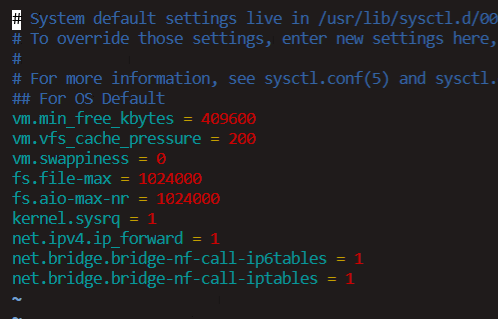
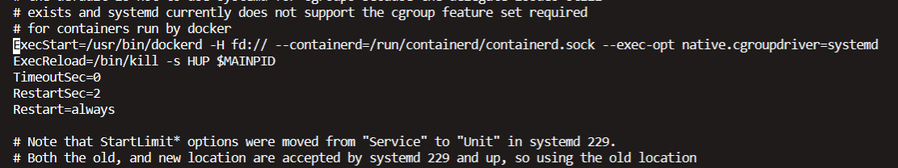

# Overview

kubernetes 安装有多种选择，本文档描述的集群安装具备如下特点：

* 使用 kubernetes 1.14
* 三个 master 组成主节点集群，通过内网 loader balancer 实现负载均衡
* 多个 worker 组成工作节点集群，通过外网 loader balancer 实现负载均衡
* 使用 calico 作为网络插件
* 使用 nginx-ingress 作为 kubernetes ingress controller


下图为 kubernetes 安装的拓扑图


* 标准机用于制作 centos 镜像，该镜像预先安装了 docker / kubelet /  kubectl / kubeadm， 并预先下载了 kubernetes 所需的 docker image
* 跳板机用于通过 ssh 端口访问标准机、master 节点、worker 节点的 shell，如果您所使用的环境中，可以直接访问各节点的 shell，也可以无需跳板机
* NAT y.y.y.y将 apiserver 的6443端口映射到外网，如果您始终只在 master 节点上执行 kubectl 命令，则无需做此映射
* Load Balancer z.z.z.z 是 kubernetes 的 Ingress 外网映射，通常是必须的 


# 安装步骤

## 制作标准机镜像

通过使用标准机镜像，可以

- **避免重复执行对测试机安装必要软件的过程**
- **以一种相对标准化的过程管理测试机的维护**

标准机镜像中预装了如下内容：

- - docker
  - gitlab-runner
  - kubernetes images

标准机镜像的制作过程描述如下：

### 安装docker

**卸载旧版本**

```bash
sudo yum remove docker \
    docker-client \ 
    docker-client-latest \ 
		docker-common \ 
		docker-latest \ 
		docker-latest-logrotate \
		docker-logrotate \
		docker-selinux \ 
		docker-engine-selinux \
		docker-engine
```

**下载依赖包及安装包**

```bash
wget https://download.docker.com/linux/centos/7/x86_64/stable/Packages/containerd.io-1.2.2-3.el7.x86_64.rpm

wget https://download.docker.com/linux/centos/7/x86_64/stable/Packages/docker-ce-cli-18.09.1-3.el7.x86_64.rpm

wget https://download.docker.com/linux/centos/7/x86_64/stable/Packages/docker-ce-18.09.1-3.el7.x86_64.rpm
```

**安装**

```bash
sudo yum install -y [containerd.io](http://containerd.io/)-1.2.2-3.el7.x86_64.rpm
sudo yum install -y docker-ce-cli-18.09.1-3.el7.x86_64.rpm
sudo yum install -y docker-ce-18.09.1-3.el7.x86_64.rpm
sudo systemctl enable docker
```

**启动 docker 服务**

```bash
sudo systemctl start docker
```

**检查 docker 版本**

```bash
docker version
```


**参考文档**

https://docs.docker.com/install/linux/docker-ce/centos/

https://docs.docker.com/install/linux/linux-postinstall/


### 安装 gitlab-runner

**安装步骤：**

```bash
wget -O /usr/local/bin/gitlab-runner https://gitlab-runner-downloads.s3.amazonaws.com/latest/binaries/gitlab-runner-linux-amd64

chmod +x /usr/local/bin/gitlab-runner

useradd --comment 'GitLab Runner' --create-home gitlab-runner --shell /bin/bash

chgrp gitlab-runner /usr/local/bin/gitlab-runner

gitlab-runner install --user=gitlab-runner --working-directory=/home/gitlab-runner
```

**添加 docker 权限：**

```bash
sudo groupadd docker
sudo usermod -aG docker gitlab-runner
```

**参考文档：**

https://docs.gitlab.com/runner/install/linux-manually.html


### K8S基本配置

**配置K8S的yum源**

```bash
cat <<EOF > /etc/yum.repos.d/kubernetes.repo
[kubernetes]
name=Kubernetes
baseurl=http://mirrors.aliyun.com/kubernetes/yum/repos/kubernetes-el7-x86_64
enabled=1
gpgcheck=0
repo_gpgcheck=0
gpgkey=http://mirrors.aliyun.com/kubernetes/yum/doc/yum-key.gpg
        http://mirrors.aliyun.com/kubernetes/yum/doc/rpm-package-key.gpg
EOF
```

**关闭swap、防火墙**

```bash
swapoff -a
```

**关闭SeLinux**

```bash
setenforce 0
```

**修改 /etc/sysctl.conf**

```vim /etc/sysctl.conf```

向其中添加

```
net.ipv4.ip_forward = 1
net.bridge.bridge-nf-call-ip6tables = 1
net.bridge.bridge-nf-call-iptables = 1
```

如下图所示




**安装kubelet、kubeadm、kubectl**

```bash
yum install -y kubelet kubeadm kubectl 
```


**修改docker Cgroup Driver为systemd**

```vim /usr/lib/systemd/system/docker.service```

向其中他添加

```--exec-opt native.cgroupdriver=systemd```

如下图所示



重启 docker

```
systemctl daemon-reload
systemctl restart docker
```


**启动kubelet**

```bash
systemctl enable kubelet && systemctl start kubelet
```


**加载 kubernetes 镜像**

由于k8s服务相关镜像在国外镜像源，国内无法访问

执行以下命令添加docker k8s国内镜像源

```bash
curl -sSL https://get.daocloud.io/daotools/set_mirror.sh | sh -s http://f1361db2.m.daocloud.io

systemctl restart docker
```

**拉取k8s相关镜像**

```bash
docker pull mirrorgooglecontainers/kube-apiserver:v1.14.3
docker pull mirrorgooglecontainers/kube-controller-manager:v1.14.3
docker pull mirrorgooglecontainers/kube-scheduler:v1.14.3
docker pull mirrorgooglecontainers/kube-proxy:v1.14.3
docker pull mirrorgooglecontainers/pause:3.1
docker pull mirrorgooglecontainers/etcd:3.3.10
docker pull coredns/coredns:1.3.1
```

**更改镜像名为k8s官网镜像**

```bash
docker tag 20a2d7035165 k8s.gcr.io/kube-proxy:v1.14.1
docker tag cfaa4ad74c37 k8s.gcr.io/kube-apiserver:v1.14.1
docker tag 8931473d5bdb k8s.gcr.io/kube-scheduler:v1.14.1
docker tag efb3887b411d k8s.gcr.io/kube-controller-manager:v1.14.1
docker tag eb516548c180 k8s.gcr.io/coredns:1.3.1
docker tag 2c4adeb21b4f k8s.gcr.io/etcd:3.3.10
docker tag da86e6ba6ca1 k8s.gcr.io/pause:3.1
```


**制作镜像**

参考阿里云制作虚拟机镜像的文档


## 初始化API Server

### 创建 ApiServer 的 ELB（私网）

监听端口：6443 / TCP

后端资源组：包含 apple-master-a-1, apple-master-b-1, apple-master-b-2

后端端口：6443

开启 按源地址保持会话

假设完成创建以后，ELB的 ip 地址为 x.x.x.x

### 初始化第一个master节点

在 apple-master-a-1机器上执行

**配置 apiserver.apple 的域名**

```bash
sudo -i
echo "x.x.x.x  apiserver.apple" >> /etc/hosts
```

> 请替换其中的 x.x.x.x 为您的负载均衡服务器的实际 ip 地址


**创建 /root/k8s/kubeadm-config.yaml**

```yaml
apiVersion: kubeadm.k8s.io/v1beta1
kind: ClusterConfiguration
kubernetesVersion: v1.14.3
controlPlaneEndpoint: "apiserver.apple:6443"

```


**初始化 apiserver**

```bash
kubeadm init --config=/root/k8s/kubeadm-config.yaml --experimental-upload-certs

```

执行结果如下图所示：


**初始化 gitlab-runner 用户的 kubectl 配置**

```bash
rm -rf /home/gitlab-runner/.kube/
mkdir /home/gitlab-runner/.kube/
cp -i /etc/kubernetes/admin.conf /home/gitlab-runner/.kube/config
chown -R gitlab-runner:gitlab-runner /home/gitlab-runner/.kube
```


**安装 calico**

（需要在安全组–ServerFarm需要为集群服务器器端口6443建立安全组规则）

```bash
su - gitlab-runner
kubectl apply -f \
		https://docs.projectcalico.org/v3.6/getting-started/kubernetes/installation/hosted/kubernetes-datastore/calico-networking/1.7/calico.yaml
```

> 安装calico， 请参考https://docs.projectcalico.org/v3.6/getting-started/kubernetes/


**等待calico安装就绪：**

执行如下命令，等待3-10分钟，直到所有的容器组处于 Running 状态

```sh
watch kubectl get pod -n kube-system
```


### 初始化第二、三个master节点 

在 apple-master-b-1 和 apple-master-b-2 机器上执行

```bash
sudo -i
echo "x.x.x.x  apiserver.apple" >> /etc/hosts
```


执行 （以下命令行在初始化 apple-master-a-1 时，被打印在控制台上，执行时应该使用控制台打印出的命令参数）

```bash
kubeadm join apiserver.apple:6443 --token ejwx62.vqwog6il5p83uk7y \
--discovery-token-ca-cert-hash sha256:6f7a8e40a810323672de5eee6f4d19aa2dbdb38411845a1bf5dd63485c43d303 \
--experimental-control-plane --certificate-key 70eb87e62f052d2d5de759969d5b42f372d0ad798f98df38f7fe73efdf63a13c
```


### 检查 apiserver初始化结果

在第一个master节点 apple-master-a-1 上执行

```bash
sudo -i
su - gitlab-runner
kubectl get nodes
```


## 初始化 worker节点

###获得 join命令参数

**在第一个master节点 apple-master-a-1 节点执行**

```bash
sudo -i
kubeadm token create --print-join-command
```

可获取kubeadm join 命令及参数，如下所示

```bash
kubeadm join apiserver.apple:6443 --token mpfjma.4vjjg8flqihor4vt     --discovery-token-ca-cert-hash sha256:6f7a8e40a810323672de5eee6f4d19aa2dbdb38411845a1bf5dd63485c43d303
```


###初始化worker

**针对所有的 worker 节点执行**

```bash
sudo -i
echo "x.x.x.x  apiserver.apple" >> /etc/hosts
kubeadm join apiserver.apple:6443 --token mpfjma.4vjjg8flqihor4vt     --discovery-token-ca-cert-hash sha256:6f7a8e40a810323672de5eee6f4d19aa2dbdb38411845a1bf5dd63485c43d303
```

> * 将 x.x.x.x 替换为 loader balancer 的实际 ip
>
> * 将 kubeadm join 命令后的参数替换为上一个步骤中实际从 apple-master-a-1 节点获得的参数


### 检查 apiserver初始化结果

在第一个master节点 apple-master-a-1 上执行

```bash
sudo -i
su - gitlab-runner
kubectl get nodes
```


## 移除 worker 节点

> 正常情况下，您无需移除 worker 节点

在准备移除的 worker 节点上执行

```bash
sudo -i	
kubeadm reset
```

在第一个 master 节点 apple-master-a-1 上执行

```bash
sudo -i
su - gitlab-runner
kubectl delete node apple-worker-x-x
```

> * 将 apple-worker-x-x 替换为要移除的 worker 节点的名字
> * worker 节点的名字可以通过在第一个 master 节点 apple-master-a-1 上执行 kubectl get nodes 命令获得


## 安装 Ingress Controller

> ingress官方文档：https://kubernetes.io/docs/concepts/services-networking/ingress/
>
> Ingress Controllers官网介绍：[https://kubernetes.io/docs/concepts/services-networking/ingress-controllers/](https://kubernetes.io/docs/concepts/services-networking/ingress-controllers/)
>
> 本文中使用如下部署方式：https://kubernetes.github.io/ingress-nginx/deploy/baremetal/#using-a-self-provisioned-edge
>
> kubernetes支持多种Ingress Controllers，本文推荐使用
>
> https://github.com/nginxinc/kubernetes-ingress


###在 apple-master-a-1 上执行

```bash
sudo -i
su - gitlab-runner
kubectl apply -f https://raw.githubusercontent.com/eip-work/eip-monitor-repository/master/dashboard/nginx-ingress.yaml
```


###在IaaS云控制台完成如下配置（**公网ELB**）

创建负载均衡 ELB：

​    监听器 1：80 / TCP， SOURCE_ADDRESS 会话保持

​    服务器资源池 1： apple-worker-x-x 的所有节点的 80端口

​    监听器 2：443 / TCP， SOURCE_ADDRESS 会话保持

​    服务器资源池 2： apple-worker-x-x 的所有节点的443端口

假设刚创建的负载均衡 ELB 的 IP 地址为： z.z.z.z


### 配置域名解析

将域名 *.apple.yourdomain.com 解析到地址负载均衡服务器 的 IP 地址 z.z.z.z


###验证配置

在浏览器访问 a.apple.yourdomain.com，将得到 404 NotFound 错误页面


